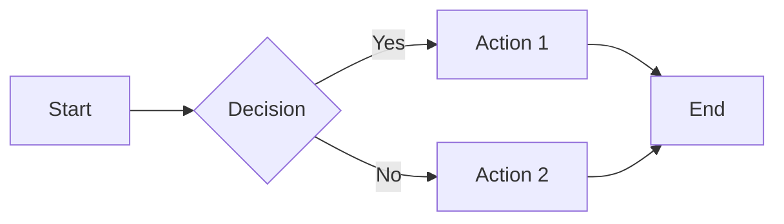

# Heading 1
## Heading 2
### Heading 3
#### Heading 4
##### Heading 5
###### Heading 6

---

## Text Formatting

This is normal text. Here is **bold text** and *italic text* and ***bold italic***. Here is ~~strikethrough~~ and ==highlighted text==. Here is `inline code` and a [[wiki link]] and an [external link](https://example.com).

Unresolved link: [[nonexistent note]]

## Lists

- Unordered item 1
- Unordered item 2
  - Nested item
    - Deep nested
- Unordered item 3

1. Ordered item 1
2. Ordered item 2
   1. Nested ordered
3. Ordered item 3

- [ ] Unchecked task
- [x] Checked task
- [ ] Another unchecked task
  - [x] Nested checked task

## Blockquotes

> This is a blockquote.
>
> > Nested blockquote.

## Callouts

> [!note] Note
> This is a note callout.

> [!tip] Tip
> This is a tip callout.

> [!info] Info
> This is an info callout.

> [!warning] Warning
> This is a warning callout.

> [!error] Error
> This is an error callout.

> [!success] Success
> This is a success callout.

> [!question] Question
> This is a question callout.

> [!example] Example
> This is an example callout.

> [!quote] Quote
> This is a quote callout.

> [!bug] Bug
> This is a bug callout.

> [!important] Important
> This is an important callout.

> [!summary] Summary
> This is a summary callout.

> [!todo] Todo
> This is a todo callout.

> [!fail] Fail
> This is a fail callout.

## Code Blocks

```javascript
function greet(name) {
  const message = `Hello, ${name}!`;
  console.log(message); // prints greeting
  return { success: true, value: 42 };
}
```

```css
.theme-dark {
  --canvas1: #121110;
  color: var(--text-normal);
  background: rgba(0, 0, 0, 0.8);
}
```

```python
class Planet:
    """A celestial body."""
    def __init__(self, name: str, radius: float):
        self.name = name
        self.radius = radius

    @property
    def is_gas_giant(self) -> bool:
        return self.radius > 25000
```

## Tables

| Left Aligned | Center Aligned | Right Aligned |
|:-------------|:--------------:|--------------:|
| Row 1 Col 1  | Row 1 Col 2    | Row 1 Col 3   |
| Row 2 Col 1  | Row 2 Col 2    | Row 2 Col 3   |
| Row 3 Col 1  | Row 3 Col 2    | Row 3 Col 3   |

## Tags

#tag1 #tag2 #nested/tag #important

## Embeds & Images

![[Placeholder for embed]]

## Footnotes

Here is a sentence with a footnote.[^1] And another one.[^2]

[^1]: This is the first footnote.
[^2]: This is the second footnote.

## Math

Inline math: $E = mc^2$

Block math:
$$
\int_{-\infty}^{\infty} e^{-x^2} dx = \sqrt{\pi}
$$

## Metadata / Properties

This file should have some frontmatter properties to test the metadata display. Add a `---` YAML block at the top if needed.

## Mermaid Diagram



## Colors Test

The following lines test bold, italic, and accent rendering together:

- **Bold text** should use the accent color
- *Italic text* should use cyan
- Links like [[test]] and [external](https://example.com) should use accent
- > Blockquote borders should use accent

## Horizontal Rules

Above this line:

---

Below this line.

---

End of theme test file.
